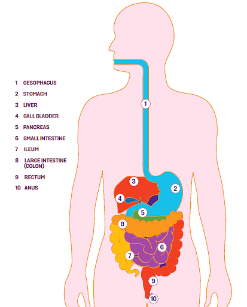

## TODO
    [x] Create js based animation with keyframes and offset
    [x] Play Pause
    [ ] create food and molecules css/svg
    [ ] create dynamic food and molecules
    [ ] disolve animation
    [ ] get number of molecules present on screen and different chambers
    [ ] and disove logically

## food flow desc
- https://www.numerade.com/ask/question/show-how-energy-is-released-to-make-growth-and-repair-occur-in-a-healthy-functioning-cell-tell-me-where-the-molecules-go-and-i-will-give-brainiest-help-fast-molecules-water-fiber-amino-acid--31818/

## food
protein,amino acid,fiber,starch,glucose,oxygen,carbon dioxide,water 

- protein 
- amino acid 
- fiber 
- starch 
- glucose 
- oxygen 
- carbon dioxide 
- water 

## system1

## p5js

https://editor.p5js.org/jaipack17/sketches/M99fmswxg

## path1 follow

- https://editor.p5js.org/rjgilmour/sketches/LLXG5yTpH

